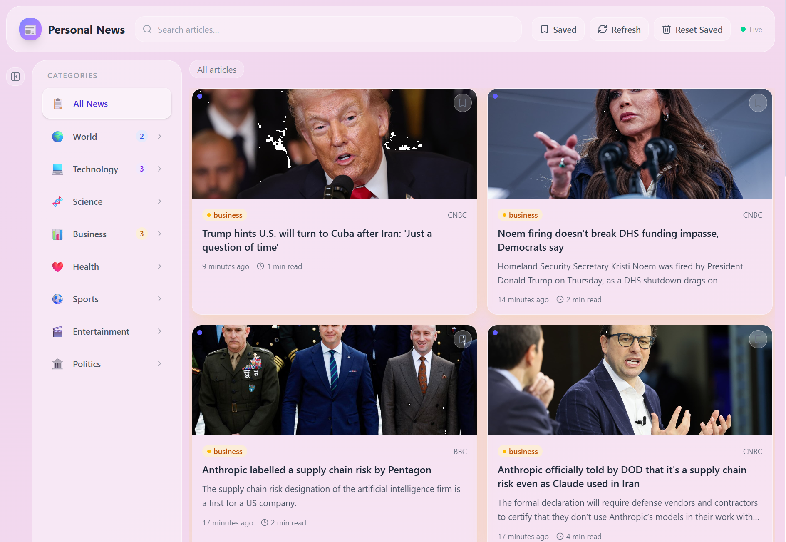

<div align="center">

# Personal News

### A self-hosted RSS news aggregator with a liquid-glass UI

[](https://nextjs.org/)
[](https://fastapi.tiangolo.com/)
[](https://pocketbase.io/)
[](https://tailwindcss.com/)
[](#-docker)
[](LICENSE)

**Aggregate 35+ RSS feeds across 8 categories. Read full articles. Bookmark what matters.**

[Getting Started](#-getting-started) · [Docker](#-docker) · [Features](#-features) · [Architecture](#-architecture) · [Configuration](#%EF%B8%8F-configuration) · [Contributing](#-contributing)

</div>

---



## Features

- **35+ curated RSS feeds** across World, Technology, Science, Business, Health, Sports, Entertainment, and Politics
- **Full-article extraction** — fetches and parses complete article text, images, authors, and keywords via newspaper4k
- **AI-powered summaries** — automatic NLP summaries and keyword extraction for every article
- **Liquid-glass UI** — translucent frosted-glass design with an animated pastel gradient background
- **Collapsible sidebar** — toggle between full category panel and compact emoji-only strip
- **Bookmark & save** — Instagram-style animated save button with filled icon, pop animation, and expanding ring burst
- **Full-text search** — search across article titles and descriptions in real time
- **Infinite scroll** — seamlessly loads more articles as you scroll down
- **Mobile-first design** — compact horizontal cards, slide-up sidebar sheet, full-screen article reader, and dynamic viewport height
- **Adaptive UI** — save button uses a corner gradient overlay for contrast against any article image
- **Fetch status badges** — each article shows whether it has the full text or just an RSS summary
- **Manage dashboard** — dedicated `/manage` page for full CRUD on feeds and categories
- **Categories in DB** — categories are stored in PocketBase and can be added, edited, or deleted from the UI
- **Background scheduler** — APScheduler fetches new articles on a configurable interval (default: 30 min)
- **Retry with backoff** — all PocketBase and HTTP requests automatically retry on transient failures (429, 5xx, timeouts)
- **Live status indicator** — shows scheduler state and last-fetch timestamp
- **Self-hosted** — runs entirely on your own hardware; no third-party services or tracking

## Tech Stack

| Layer | Technology |
|-------|------------|
| **Frontend** | Next.js 16, React 19, Tailwind CSS 4, SWR, Lucide Icons |
| **Backend** | Python 3.10+, FastAPI, APScheduler, newspaper4k, feedparser |
| **Database** | PocketBase (SQLite-based, single binary) |
| **Deployment** | Any machine — no Docker required (though Docker works great too) |

## Architecture

```
┌────────────────────┐     HTTP/REST      ┌─────────────────────┐
│                    │  ◄──────────────►  │                     │
│   Next.js 16 SPA   │                    │   FastAPI Backend    │
│   (React 19 + SWR) │                    │                     │
│   localhost:3000    │                    │   localhost:8000     │
│                    │                    │                     │
└────────────────────┘                    └──────────┬──────────┘
                                                     │
                                          ┌──────────▼──────────┐
                                          │   APScheduler       │
                                          │   (every 30 min)    │
                                          └──────────┬──────────┘
                                                     │
                              ┌───────────────────────┼───────────────────────┐
                              │                       │                       │
                    ┌─────────▼─────────┐   ┌────────▼────────┐   ┌─────────▼─────────┐
                    │  RSS Feeds (35+)  │   │  newspaper4k    │   │   PocketBase DB   │
                    │  feedparser       │   │  Full-text +    │   │   localhost:8090   │
                    │                   │   │  NLP extraction │   │                   │
                    └───────────────────┘   └─────────────────┘   └───────────────────┘
```

## Getting Started

### Prerequisites

- **Python 3.10+**
- **Node.js 18+** and npm
- **PocketBase** — [download the latest release](https://pocketbase.io/docs/)

### 1. Clone the repository

```bash
git clone https://github.com/your-username/personal-news.git
cd personal-news
```

### 2. Start PocketBase

Download PocketBase for your platform, then run:

```bash
./pocketbase serve
```

PocketBase will start on `http://127.0.0.1:8090`. Create an admin account through the admin UI at `http://127.0.0.1:8090/_/`.

### 3. Configure the backend

```bash
cd backend
cp .env.example .env
```

Edit `.env` with your PocketBase credentials:

```env
POCKETBASE_URL=http://127.0.0.1:8090
POCKETBASE_ADMIN_EMAIL=admin@example.com
POCKETBASE_ADMIN_PASSWORD=your-secure-password
PORT=8000
FETCH_INTERVAL_MINUTES=30
MAX_ARTICLES_PER_FEED=20
```

### 4. Install backend dependencies & set up the database

```bash
pip install fastapi uvicorn httpx feedparser newspaper4k apscheduler python-dotenv lxml_html_clean
python setup_db.py
```

This creates the `categories`, `feeds`, and `articles` collections in PocketBase and seeds all categories and 35+ RSS feeds.

### 5. Start the backend

```bash
python main.py
```

The API server starts on `http://localhost:8000`. The scheduler begins fetching articles automatically.

### 6. Install and start the frontend

```bash
cd ../frontend
npm install
npm run dev
```

Open **[http://localhost:3000](http://localhost:3000)** and start reading.

## Docker

Run the entire stack (backend + frontend) in a single container. PocketBase still runs externally.

### Build

```bash
docker build -t personal-news .
```

### Run

```bash
docker run -d \
  --name personal-news \
  -p 3000:3000 \
  -p 8000:8000 \
  -e POCKETBASE_URL=http://host.docker.internal:8090 \
  -e POCKETBASE_ADMIN_EMAIL=admin@example.com \
  -e POCKETBASE_ADMIN_PASSWORD=your-secure-password \
  personal-news
```

> **Tip:** Use `host.docker.internal` to reach PocketBase running on your host machine. On Linux, add `--add-host=host.docker.internal:host-gateway` to the `docker run` command.

The frontend is available at `http://localhost:3000` and the API at `http://localhost:8000`.

### Environment variables

All backend configuration can be passed via `-e` flags or an env file:

```bash
docker run -d \
  --name personal-news \
  -p 3000:3000 -p 8000:8000 \
  --env-file backend/.env \
  personal-news
```

## Configuration

All backend configuration is done through environment variables in `backend/.env`:

| Variable | Default | Description |
|----------|---------|-------------|
| `POCKETBASE_URL` | `http://127.0.0.1:8090` | PocketBase server URL |
| `POCKETBASE_ADMIN_EMAIL` | — | Admin email for PocketBase authentication |
| `POCKETBASE_ADMIN_PASSWORD` | — | Admin password for PocketBase authentication |
| `PORT` | `8000` | Port for the FastAPI backend |
| `FETCH_INTERVAL_MINUTES` | `30` | How often the scheduler fetches new articles |
| `MAX_ARTICLES_PER_FEED` | `20` | Maximum articles to process per feed per fetch cycle |

## API Endpoints

| Method | Endpoint | Description |
|--------|----------|-------------|
| `GET` | `/api/feeds` | List all feeds (optional `?category=` filter) |
| `POST` | `/api/feeds` | Create a new feed |
| `PATCH` | `/api/feeds/:id` | Update a feed |
| `DELETE` | `/api/feeds/:id` | Delete a feed |
| `POST` | `/api/feeds/:id/toggle` | Enable or disable a feed |
| `GET` | `/api/articles` | List articles with filtering, search, and pagination |
| `GET` | `/api/articles/:id` | Get a single article (marks as read) |
| `PATCH` | `/api/articles/:id/save` | Toggle bookmark on an article |
| `PATCH` | `/api/articles/:id/read` | Mark an article as read |
| `POST` | `/api/articles/reset-saved` | Delete all articles from the database |
| `POST` | `/api/refresh` | Manually trigger a full feed refresh |
| `GET` | `/api/status` | Scheduler status and last-fetch stats |
| `GET` | `/api/categories` | List all categories |
| `POST` | `/api/categories` | Create a new category |
| `PATCH` | `/api/categories/:id` | Update a category |
| `DELETE` | `/api/categories/:id` | Delete a category |

## RSS Feed Sources

<details>
<summary><strong>35+ feeds across 8 categories</strong> (click to expand)</summary>

| Category | Feeds |
|----------|-------|
| **World** | BBC World News, Reuters, Al Jazeera, The Guardian, AP News |
| **Technology** | TechCrunch, Ars Technica, The Verge, Wired, Hacker News, MIT Technology Review |
| **Science** | BBC Science, NASA, New Scientist, Scientific American, Nature |
| **Business** | BBC Business, The Guardian, CNBC, Bloomberg |
| **Health** | BBC Health, The Guardian, Medical News Today, Harvard Health |
| **Sports** | BBC Sport, ESPN, The Guardian |
| **Entertainment** | BBC Entertainment, Variety, The Guardian Culture, Pitchfork |
| **Politics** | BBC Politics, The Guardian, Politico |

</details>

## Project Structure

```
personal-news/
├── backend/
│   ├── main.py              # FastAPI app, routes, CRUD endpoints
│   ├── pocketbase.py        # PocketBase REST client with retry
│   ├── fetcher.py           # RSS + newspaper4k article extraction
│   ├── scheduler.py         # APScheduler background job
│   ├── feeds_data.py        # Default feed list and categories
│   ├── setup_db.py          # DB setup: categories, feeds, articles + seeding
│   ├── config.py            # Environment variable loading
│   ├── dns_patch.py         # DNS resolution fallback
│   └── .env.example         # Example environment config
├── frontend/
│   ├── src/
│   │   ├── app/
│   │   │   ├── page.tsx     # Main dashboard page
│   │   │   ├── manage/
│   │   │   │   └── page.tsx # Feed & category management dashboard
│   │   │   ├── layout.tsx   # Root layout with metadata
│   │   │   └── globals.css  # Glass styles, animations, save button keyframes
│   │   ├── components/
│   │   │   ├── Header.tsx         # Search, refresh, saved filter, manage link
│   │   │   ├── Sidebar.tsx        # Collapsible category nav + feed toggles
│   │   │   ├── MobileSidebar.tsx  # Slide-up bottom sheet for mobile
│   │   │   ├── NewsGrid.tsx       # Infinite-scroll article grid
│   │   │   ├── NewsCard.tsx       # Article card (horizontal mobile / vertical desktop)
│   │   │   ├── ArticleModal.tsx   # Full article reader (full-screen on mobile)
│   │   │   ├── SaveButton.tsx     # Animated bookmark with overlay/surface variants
│   │   │   ├── CategoryBadge.tsx  # Colored category labels
│   │   │   └── SkeletonCard.tsx   # Loading placeholders
│   │   └── lib/
│   │       ├── api.ts       # Backend API client (feeds, articles, categories CRUD)
│   │       ├── types.ts     # TypeScript interfaces
│   │       └── categoryColors.ts # Category color mapping
│   ├── package.json
│   └── tsconfig.json
├── docs/
│   └── screenshot.png
├── Dockerfile
├── start.sh
├── .dockerignore
├── .gitignore
└── README.md
```

## Contributing

Contributions are welcome! Feel free to open an issue or submit a pull request.

1. Fork the repository
2. Create your feature branch (`git checkout -b feature/amazing-feature`)
3. Commit your changes (`git commit -m 'Add amazing feature'`)
4. Push to the branch (`git push origin feature/amazing-feature`)
5. Open a Pull Request

## License

This project is licensed under the MIT License. See the [LICENSE](LICENSE) file for details.

---

<div align="center">

**Built with [Next.js](https://nextjs.org/), [FastAPI](https://fastapi.tiangolo.com/), and [PocketBase](https://pocketbase.io/)**

</div>
